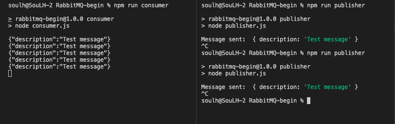

# RabbitMQ-Begin 

### Starting (M1-ARM64)

```
Install RabbitMQ Docker

cd ./docker_Container
docker-compose up

```

```
Start

cd ./RabbitMQ-begin

npm init -y

```

```
Install Lib

npm install -save amqblib

```


```
Sending message

npm run publisher
```

```
Reading message

npm run consumer
```

<p>
    

</p>

#

####    Thank You Kablosuzkedi